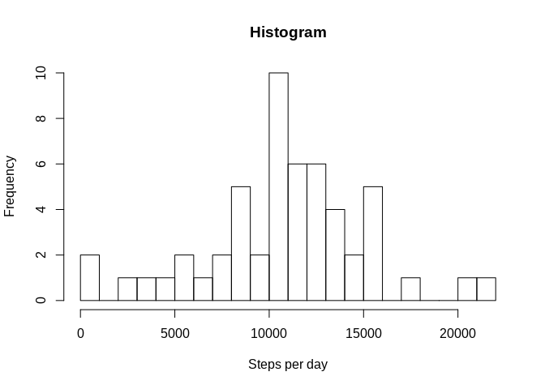
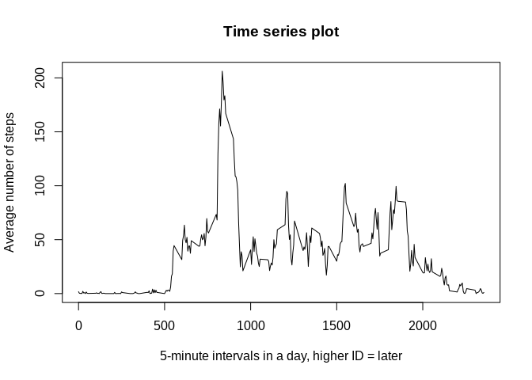
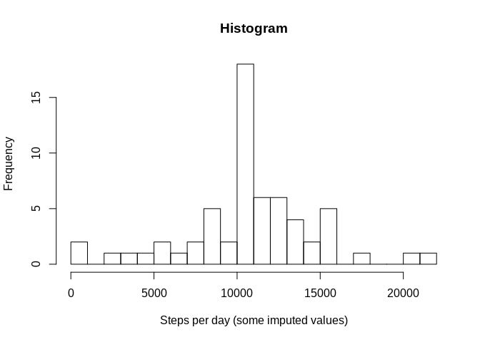
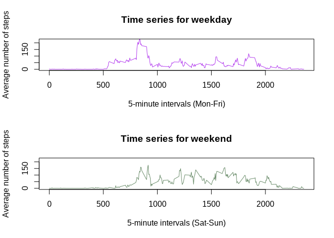

## Loading and preprocessing the data

Let's download the data from the source first. Let's get a specific version
(using SHA identifier) so below can more reliably be reproduced if necessary.

```r
dsite="https://github.com/"
fdir= "rdpeng/RepData_PeerAssessment1/raw/"
sha=  "9abcd99566ad027022e4aafbffb5768f9ee11182"             ## specific version
fname="activity.zip"
download.file(paste0(dsite,fdir,sha,"/",fname),destfile="activity.zip")
rm(dsite,fdir,sha,fname)                                    ## discard link info
date()                             ## for the record, show the download time too
```

```
## [1] "Thu Mar  1 00:58:25 2018"
```

Let's not unpack the .zip (with unzip) in the user's working directory
'creating' another file there, we can use unz instead and examine the result
with str().

```r
activity <- read.csv (unz("activity.zip", filename="activity.csv"),
                      stringsAsFactors = FALSE)
str(activity)
```

```
## 'data.frame':	17568 obs. of  3 variables:
##  $ steps   : int  NA NA NA NA NA NA NA NA NA NA ...
##  $ date    : chr  "2012-10-01" "2012-10-01" "2012-10-01" "2012-10-01" ...
##  $ interval: int  0 5 10 15 20 25 30 35 40 45 ...
```

The data frame looks mostly usable already, but let's convert the dates from
text characters to actual dates.
Doing that will at the moment at least make the output of summary() more useful:
mean, median cannot be calculated for text.


```r
activity$date <- as.Date(activity$date)
summary(activity)
```

```
##      steps             date               interval     
##  Min.   :  0.00   Min.   :2012-10-01   Min.   :   0.0  
##  1st Qu.:  0.00   1st Qu.:2012-10-16   1st Qu.: 588.8  
##  Median :  0.00   Median :2012-10-31   Median :1177.5  
##  Mean   : 37.38   Mean   :2012-10-31   Mean   :1177.5  
##  3rd Qu.: 12.00   3rd Qu.:2012-11-15   3rd Qu.:1766.2  
##  Max.   :806.00   Max.   :2012-11-30   Max.   :2355.0  
##  NA's   :2304
```

## What is the mean total number of steps taken per day?

We will ignore the NA (not available) values for the moment and calculate the
mean total number of steps per day. One way of doing this is getting the total
(sum of) steps per day by creating a summarized data frame with aggregate, and
then getting the summary of that summary.


```r
stepsperday <- aggregate(x=activity[1],by=list(date=activity$date),sum)
summary(stepsperday)
```

```
##       date                steps      
##  Min.   :2012-10-01   Min.   :   41  
##  1st Qu.:2012-10-16   1st Qu.: 8841  
##  Median :2012-10-31   Median :10765  
##  Mean   :2012-10-31   Mean   :10766  
##  3rd Qu.:2012-11-15   3rd Qu.:13294  
##  Max.   :2012-11-30   Max.   :21194  
##                       NA's   :8
```

According to the summary, the answer is *Mean :10766* steps per day, and the
median is almost exactly the same: *Median :10765*. Let's try a slightly
different command and see if we get the same results. We do.


```r
mean(tapply(activity$steps,activity$date,sum),na.rm=TRUE)
```

```
## [1] 10766.19
```

```r
median(tapply(activity$steps,activity$date,sum),na.rm=TRUE)
```

```
## [1] 10765
```

The histogram also shows that the most frequently occurring quantities of steps
per day are around 10.000, so it looks plausible that median and mean would be
around that value.
To create the histogram, the summarised (aggregated) data frame is used.


```r
hist (stepsperday$steps, breaks=20,
      xlab="Steps per day",
      main="Histogram")
```

<!-- -->

## What is the average daily activity pattern?

We need to be able to draw the interval ID numbers on the x-axis (representing
the daily flow of time) and the average number of steps taken in that interval.
The aggregate command (or my use of it) seems to have some trouble summarising
per interval ID number here, possibly due to NA values. But tapply will do.


```r
tapplied<-tapply(activity$steps,activity$interval,mean,na.rm=TRUE)
plot(rownames(tapplied),tapplied,type="l",
     xlab="5-minute intervals in a day, higher ID = later",
     ylab="Average number of steps",
     main="Time series plot")
```

<!-- -->

Let's find the (average) peak activity moment in the day. Judging by the plot,
the interval ID should be between 800-900 and the number of steps slightly over
200.

```r
tapplied[which.max(tapplied)]
```

```
##      835 
## 206.1698
```

## Imputing missing values

So far the NA values were just ignored. It can be better, even if just for the
sake of exploration, to see if the NA values can be replaced by educated
guesses, placeholders or such. From the str() and summary() commands we ran at
loading (see *Loading and preprocessing the data* above) we know that

*	only the steps column has NA values
*	there are 2304 rows where steps = NA
*	there are 17568 rows in total

Let's reconfirm those numbers and get a percentage.


```r
sum(is.na(activity$steps))
```

```
## [1] 2304
```

```r
nrow(activity)
```

```
## [1] 17568
```

```r
sum(is.na(activity$steps))/nrow(activity)
```

```
## [1] 0.1311475
```

Slightly more than 13% of rows have a NA, which is quite a bit.
For each NA value we can look up in the tapplied table what the mean value is
for that interval, and fill in that value instead of the NA. The first rows
immediately had NAs, so head() will show if it worked.
Let's make a separate data frame for this.


```r
imputed <- activity
for (i in 1:17568) {
        if (is.na(imputed[i,1])) {
                                  imputed[i,1] <- tapplied[match(imputed[i,3],
                                                           rownames(tapplied))]
        }
}
head(imputed)
```

```
##       steps       date interval
## 1 1.7169811 2012-10-01        0
## 2 0.3396226 2012-10-01        5
## 3 0.1320755 2012-10-01       10
## 4 0.1509434 2012-10-01       15
## 5 0.0754717 2012-10-01       20
## 6 2.0943396 2012-10-01       25
```

Now let's retry the earlier commands to see if anything changed, and if the
histogram looks different.


```r
impstepsperday <- aggregate(x=imputed[1],by=list(date=imputed$date),sum)
summary(impstepsperday)
```

```
##       date                steps      
##  Min.   :2012-10-01   Min.   :   41  
##  1st Qu.:2012-10-16   1st Qu.: 9819  
##  Median :2012-10-31   Median :10766  
##  Mean   :2012-10-31   Mean   :10766  
##  3rd Qu.:2012-11-15   3rd Qu.:12811  
##  Max.   :2012-11-30   Max.   :21194
```

```r
hist (impstepsperday$steps, breaks=20,
      xlab="Steps per day (some imputed values)",
      main="Histogram")
```

<!-- -->

The median and the mean did not change, but the quartiles and histogram hint
that values have been 'pulled to the middle', so to speak: they are grouped
closer to the median and mean. This stands to reason if values get generated
based on the known averages: adding only 'bland' guesses makes the results look
blander.

## Are there differences in activity patterns between weekdays and weekends?

Let's return to the original, real values, NAs and all. Making no distinction
between work days and weekends, this person took the most steps in interval
835, possibly corresponding to around 08:35 in the morning, perhaps on the way
to work? Let's make the distinction and investigate.


```r
activity$daytype<-weekdays(activity$date)           ## new column
activity$daytype<-gsub("^[S].*$","weekend",         ## day name with S = weekend
                       activity$daytype) 
activity$daytype<-gsub("^[A-Z].*$","weekday",    ## after that still starts with
                       activity$daytype)         ##     capital letter = weekday
table(activity$daytype)
```

```
## 
## weekday weekend 
##   12960    4608
```

Weekend days account for around 2/7 of the days which seems right.

On to plotting. The aggregate command still does not work well for me here. We
can use a few subsets and tapply like before, then draw two plots onto one
'canvas'.


```r
weekdays<-subset(activity,activity$daytype=="weekday")
weekdays<-tapply(weekdays$steps,weekdays$interval,mean,na.rm=TRUE)
weekends<-subset(activity,activity$daytype=="weekend")
weekends<-tapply(weekends$steps,weekends$interval,mean,na.rm=TRUE)
par (mfrow=c(2,1))                            ## first plot on top of the second
plot(rownames(weekdays),weekdays, type="l",
     col="darkorchid2",
     xlab="5-minute intervals (Mon-Fri)",
     ylab="Average number of steps",
     ylim=c(0,220),
     main="Time series for weekday")
plot(rownames(weekends),weekends, type="l",
     col="darkseagreen4",
     xlab="5-minute intervals (Sat-Sun)", 
     ylab="Average number of steps",
     ylim=c(0,220),                           ## same as above, helps comparison
     main="Time series for weekend")
```

<!-- -->

The average number of steps starts going up earlier in the day on normal
weekdays, and has a higher peak, but it stays low later in the day. In the
weekend, the average number of steps per 5-minute interval is more constant
throughout the day, leading to a higher total number of steps per day.
